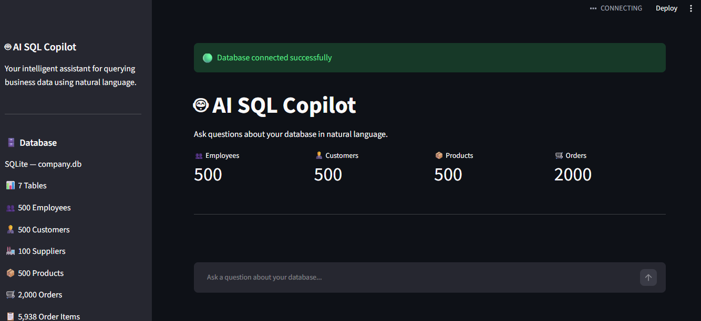
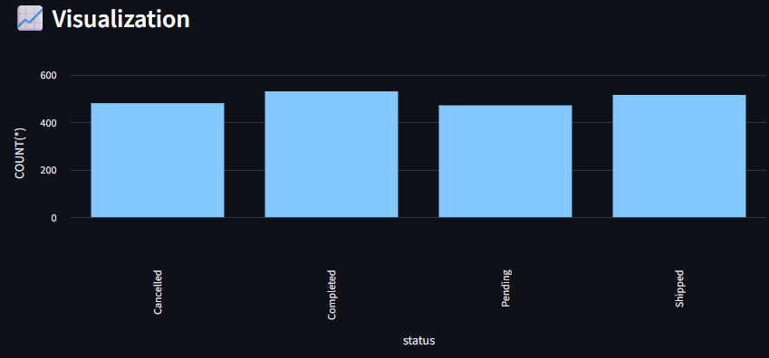
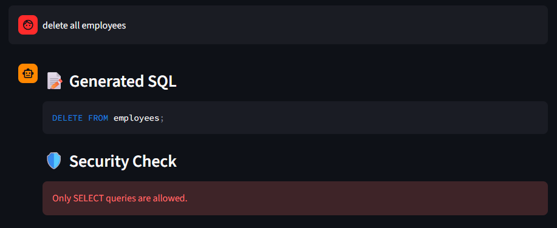
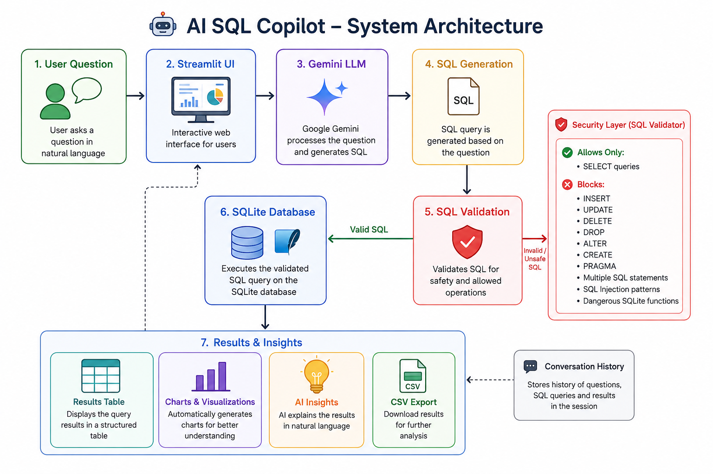

# 🤖 AI SQL Copilot

An AI-powered conversational SQL assistant that allows users to query a business database using natural language.

The application uses **Google Gemini** to convert natural-language questions into SQL, validates the generated query for security, executes safe queries against a **SQLite database**, and presents the results through an interactive **Streamlit dashboard**.

---

## ✨ Key Features

### 🗣️ Natural Language → SQL

* Ask database questions using everyday language.
* Google Gemini generates the corresponding SQL query.

### 🔐 SQL Security Validation

* Only `SELECT` queries are permitted.
* Blocks dangerous operations such as `DELETE`, `UPDATE`, `INSERT`, `DROP`, `ALTER`, `CREATE`, and `PRAGMA`.
* Prevents multiple SQL statements and dangerous SQLite functions.

### 🔧 Automatic SQL Correction

* Detects SQL execution errors.
* Uses AI to generate a corrected query.

### 📊 Interactive Analytics

* Displays query results in a structured table.
* Automatically generates visualizations when appropriate.

### 💡 AI-Generated Insights

* Provides a natural-language explanation of query results.

### 📥 CSV Export

* Download query results for further analysis.

### 💬 Conversation History

* Keeps previous questions and generated SQL visible during the session.

### 📈 Dynamic Database Metrics

* Displays live record counts from the database.

### 🟢 Database Monitoring

* Shows whether the SQLite database connection is working.

---

## 🖥️ Project Screenshots

### Dashboard

### Analytics

### Security Validation

---

## 🏗️ System Architecture

The following architecture shows how the AI SQL Copilot processes a natural-language question, validates AI-generated SQL, executes safe queries, and presents results and insights.

---

## 🛠️ Technology Stack

| Technology           | Purpose                                                 |
| -------------------- | ------------------------------------------------------- |
| 🐍 **Python**        | Core programming language and application logic         |
| 🎈 **Streamlit**     | Interactive web application interface                   |
| 🗄️ **SQLite**       | Database storage and SQL query execution                |
| 🤖 **Google Gemini** | Converts natural-language questions into SQL queries    |
| 📊 **Pandas**        | Data processing and analysis                            |
| 📈 **Plotly**        | Interactive data visualization                          |
| 🔐 **Python-dotenv** | Secure management of API keys and environment variables |

---

## 🧠 Key Technical Learnings

* Learned how to integrate **Large Language Models (LLMs)** with structured databases.
* Built a system that converts **natural-language questions into SQL queries**.
* Implemented **SQL validation and safety checks** before executing AI-generated queries.
* Worked with **SQLite databases** for storing and querying structured data.
* Developed an interactive data application using **Streamlit**.
* Used **Pandas** for data processing and analysis.
* Created interactive visualizations to make database insights easier to understand.
* Learned how to manage API keys securely using **environment variables**.

---

## 🚀 Future Improvements

* Support additional databases such as **MySQL** and **PostgreSQL**.
* Add support for uploading custom datasets and automatically creating database tables.
* Improve SQL validation with advanced security rules and query restrictions.
* Add conversational memory to support follow-up questions.
* Provide automatic chart recommendations based on query results.
* Add user authentication and role-based access control.
* Enable users to download query results and visualizations.
* Deploy the application using cloud platforms for scalable access.

---

## 👩‍💻 Author

**Aarthi**

Chemical Engineering Student | Aspiring Data Analyst | AI & Data Enthusiast

